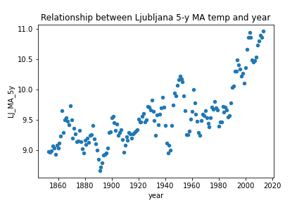
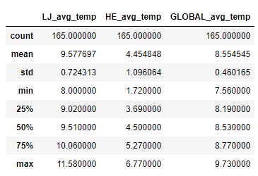

# Project Overview
In this project I am analyzing and observing global weather data (temperatures) and data in selected cities (Ljubljana and Helsinki) from years 1849 to 2013. Data was retrieved from a Udacity database, using SQL queries and stored locally in csv files. In order to observe long term trends, I calculated 5-year moving averages for all datasets.

## Data Analysis Process
### Questions
- [x]	Is local city hotter or cooler on average compared to the global average? 
- [x]	Has the difference been consistent over time?
- [x]	How do the changes in local city’s temperatures over time compare to the changes in the global average?
- [x]	What does the overall trend look like? 
- [x]	Is the world getting hotter or cooler? 
- [x]	What is the correlation coefficient?

### Data Wrangling 
Below are listed steps in data analysis wrangling process.
Retrieving data form database using SQL queries and exporting data to csv file.

Select the city list | select data for specific cities | select all data form global_data
:---: | :---: | :---:
SELECT * FROM city_list | SELECT * FROM city_data  WHERE city = 'Ljubljana'; | SELECT * FROM global_data

#### Data Wrangling in Excel 
1.	Exported data from csv files to xlsx files, using copy-sheet to new file, in order to perform calculations and creating visuals.
2.	Used `VLOOKUP` formula to gather data on the same worksheet.
3.	Used `IFERROR` formula to handle missing values, replacing them with string “NULL” to avoid overwriting zeros.
4.	Handling missing values:
If I want to compare the temperatures, I need data for all cities and global data. For this reason, I decided to filtered out missing values and keep only data that has values for all selected cities and global data. I filtered out missing data and copy-paste selected data to new worksheet in order to work on data without missing values (alternatively I performed VLOOKUP technique on the data that has “the least data points” – in this case the null values are not transferred).

#### Data Wrangling with Python in Jupyter Notebook  
1.	Read in data from excel file.
2.	Dropped unnecessary columns ‘city’ and ‘country’.
3.	Dropped null values, using `dropna()` function.
4.	Checked cleaned dataset, ensuring is ready for performing analysis.

### EDA & Feature Engineering 

**Correlation coefficient**

>Correlation coefficients are used to measure the strength and direction of a relationship between two variables (2). The value of the correlation coefficient varies between +1 and -1. As the correlation coefficient value goes towards 0, the relationship between the two variables will be weaker. The most common correlation measures used is Pearson R Correlation (3). A correlation between variables indicates that as one variable changes in value, the other variable tends to change in a specific direction.  Understanding that relationship is useful because we can use the value of one variable to predict the value of the other variable (4).

**Correlation and P value**
>Correlation is a way to test if two variables have any kind of relationship, whereas p-value tells us if the result of an experiment is statistically significant (5). P-value evaluates how well data rejects the null hypothesis, which states that there is no relationship between two compared groups. Successfully rejecting this hypothesis tells you that your results may be statistically significant (6).

**Statistical Significance**
>Statistical significance is the likelihood that the difference in conversion rates between a given variation and the baseline is not due to random chance. A result of an experiment is said to have statistical significance, or be statistically significant, if it is likely not caused by chance for a given statistical significance level (6).

**What's the correlation coefficient for this dataset?**
A great way to explore, to get familiar with the data, finding patterns and building intuitions is to calculate, visualize and uncover complex and unknown relationships between variables. 

**Calculating Correlation Coefficient**

I calculated correlation coefficient between year & global temperature and correlation between global average temperatures & local city temperatures and observed what kind of correlation (if any) exists. Calculation for correlation coefficient was made with Excel and Python.

-	Calculation in excel: Using `Data Analysis tool` from `Analysis tab`.
-	Calculation in Python: Using Pandas `corr()` function.

Correlation coefficient between year and global temperature is ***0.86***. This value indicates strong positive correlation, meaning, when the year change there is an increase (change) in the temperature.
Correlation coefficient between local city temperature and global temperature is ***0.62***. This value indicates positive correlation, but it is not a strong correlation.

**Visualizing Relationships**

  

<i>Figure 1: Relationship between global avg temp. and year. </i> 
<i>Figure 2: Relationship between 5y moving average and year.</i>  
<i>Figure 3: Relationship between global avg temp and avg. temp in Ljubljana. </i> 

<i>Figure 4: Correlation Coefficient Heat Map.</i>

**Calculating Moving Average**

In general, the moving average smoothens the data and is mostly used with time series data to capture the short-term fluctuations while focusing on longer trends. Besides weather reports moving average is widely used in stock prices, gross domestic products, employment, etc. (1). 

_-	Calculating 5-year moving average in Excel - steps_  
Calculated average for first 5 years, using AVERAGE() function.
Populated the formula for the entire column, by selecting the cell with the formula, moving the mouse to the bottom-left corner and double clicked. 
**Formula used:** `=AVERAGE(B2:B6)`

_-	Calculating 5-year moving average in Python – steps_  
Formula for moving average for this project was created with the help of “datacamp website” (1). I used Pandas build in function “rolling window” and chain the function with mean() function. Parameter window was set to 5. Columns were selected with Pandas iloc method. 
**Formula used:** `df['LJ_MA_5y'] = df.iloc[:,1].rolling(window=5).mean()`

### Observations, Answering Questions & Drawing Conclusions 

**-	Is local city hotter or colder on average compared to the global average?** 
_Observation from the chart:_  
From the line charts (Figure 5, Figure 6, Figure 7, Figure 8) I can observe that local city Ljubljana is hotter than global average, while local city Helsinki is cooler than global average. However, the temperatures are rising in both cities and so do global average temperatures.

_Observation from descriptive statistics:_  
From descriptive statistics I can observe that Ljubljana is 1.02°C hotter and Helsinki is 4.10 °C cooler than global average.

<i>Figure 5: Descriptive Statistics for Average global Temperature and Average Temperatures in Ljubljana and Helsinki.</i>

**-	How do changes in your city’s temperature over time compare to the changes in the global average?**
From the line charts (Figure 6, Figure 7, Figure 8, Figure 9) I can observe that temperature trend in local cities globally is similar – the temperatures are rising. However, the fluctuation of temperatures in local cities is more obvious than for global average temperatures. 

**-	What does the overall trend look like? Is the world getting hotter or cooler?**
In the line chart (Figure 6) I plotted a trend line for the global average and I can see that overall positive trend, meaning that temperatures are rising and the world’s getting hotter. I can see the same pattern from the line chart (Figure 7). City with cooler temperatures than global average is also getting hotter. 

**-	Has the trend been consistent over the last few hundred years? Has the difference been consistent over time?**
The temperatures are not consistent over time. Although, the overall trend is positive, I can see fluctuation over the years from line charts Figure 6, Figure 7, Figure 8, Figure 9. From scatter plots (Figure 1 and Figure 2) we can see almost exponential rise of the temperature in the last 25 years.

### Communication & Visualizations

What were key considerations when deciding how to visualize the trends? 
o	Choosing the right chart type: line chart is best choice for continuous data, scatter plots are best to show correlation between two variables. 
o	Ensuring that visualizations clearly communicate findings, without extra explanation. 
o	Ensuring charts have all components (labels, titles, legends). 
o	Other visual components (colors, x and y axis intervals)

**VISUALIZATIONS – IN EXCEL**

 

<i>Figure 6 & &: 5-year Moving Average Trend for Global and Local Cities Temperatures.</i>

**VISUALIZATIONS – WITH PYTHON IN JUPYTER NOTEBOOK**

 

<i>Figure 9 & 10: 5-year Moving Average Trend for Global and Local Cities Temperatures.</i>

### References

(1) Sharma, Aditya. “Moving Averages in pandas.” DataCamp. 24. June 2019. Web. 23. March 2021 https://www.datacamp.com/community/tutorials/moving-averages-in-pandas</i> 
(2) “Correlation Coeficient: Simple Definition, Formula, Easy Steps.” Statistics How To. n.p. Web. 23. March 2019 https://www.statisticshowto.com/probability-and-statistics/correlation-coefficient-formula/</i> 
(3) Magiya, Joseph. “Pearson Coefficient of Correlation Explained.” Towards Data Science. 26. May 2019. Web. 23. March 2021 https://towardsdatascience.com/pearson-coefficient-of-correlation-explained-369991d93404</i> 
(4) Frost, Jim. “Interpreting Correlation Coefficients.” Statistics by Jim. n.p. Web. 23. March 2021 https://statisticsbyjim.com/basics/correlations/</i> 
(5) “Correlation and P value.” The Data School by Chartio. 22. March 2021. Web. 23. March 2021 https://dataschool.com/fundamentals-of-analysis/correlation-and-p-value/</i> 
(6) “Statistical Significance.” Optimozely. n.p. Web. 23. March 2021 
https://www.optimizely.com/optimization-glossary/statistical-significance/#:~:text=Statistical%20Significance%20Definition&text=A%20result%20of%20an%20experiment,a%20given%20statistical%20significance%20level.&text=It%20also%20means%20that%20there,that%20you%20could%20be%20wrong.</i> 

### Other Supportive Articles

Magiya, Joseph. “Pearson Coefficient of Correlation with Python.” Levelup.Gitconnected. 14. April 2019. Web. 23. March 2021
https://levelup.gitconnected.com/pearson-coefficient-of-correlation-using-pandas-ca68ce678c04
